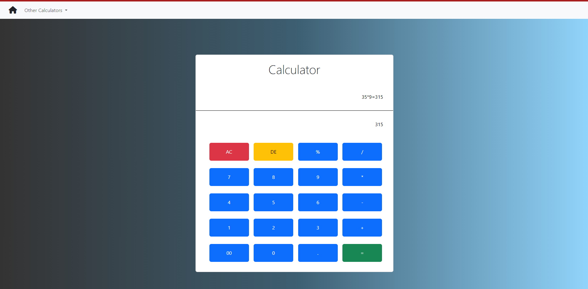
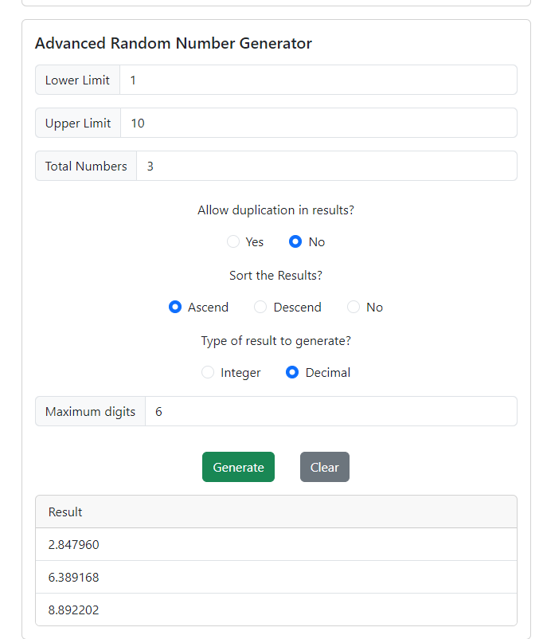
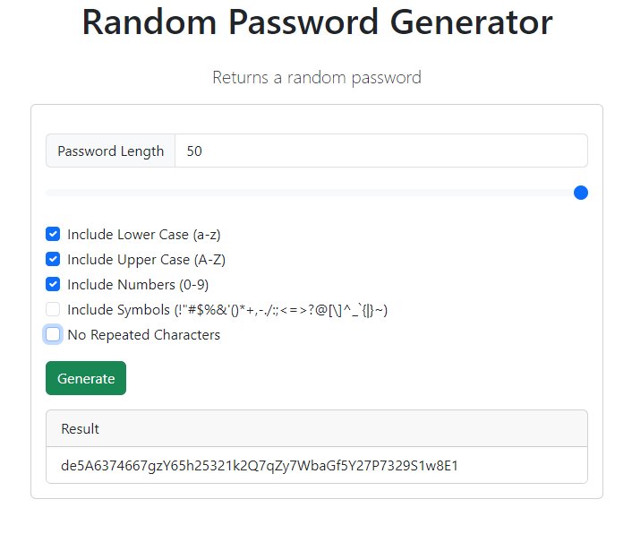
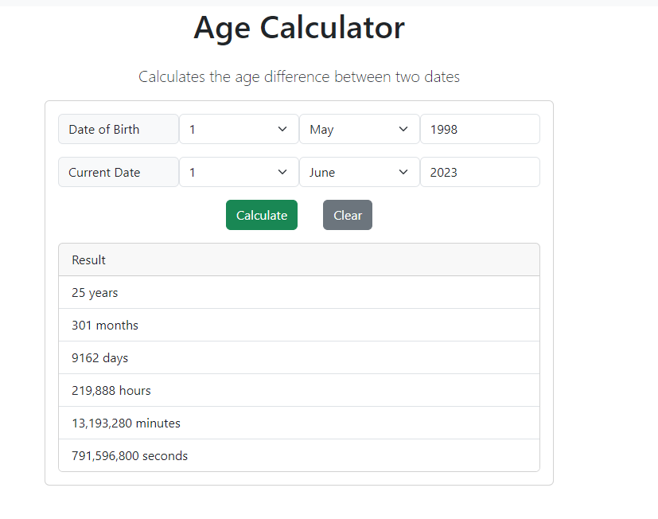
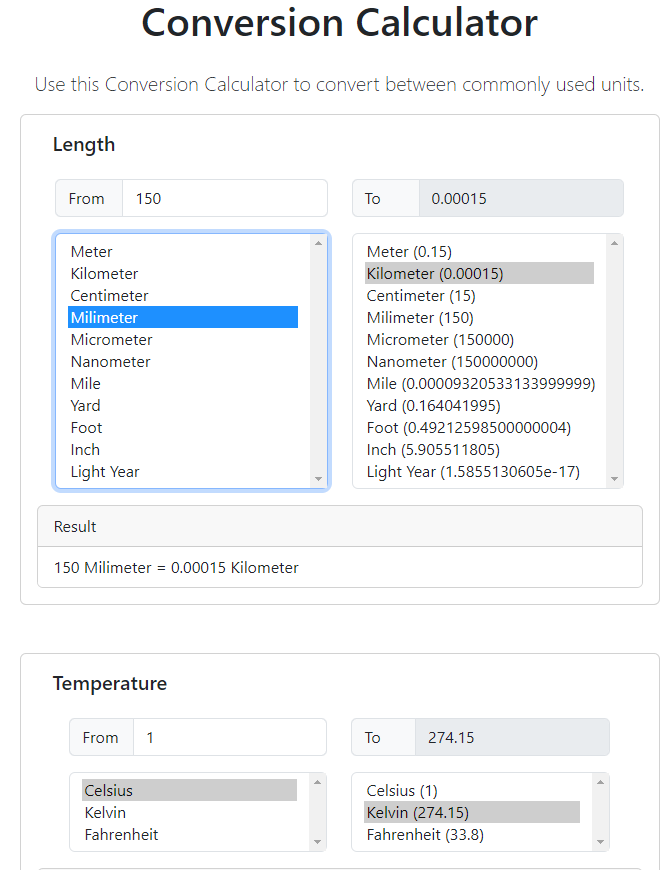

# Calculator Project

## Overview

The Calculator Project is a collection of applications that provide various mathematical operations and functions. Each application focuses on a specific task and offers a user-friendly interface for seamless interaction.

## Calculator

The Calculator application allows you to perform diverse mathematical operations. It displays the previous operation on top, ensuring a clear view of your calculations.

## Random Number Generator

The Random Number Generator application generates random numbers with advanced features. It provides additional filters to enhance your random number generation experience.

## Random Password Generator

The Random Password Generator application creates secure and random passwords based on specified filters.

## Age Calculator

The Age Calculator application calculates the difference between two given dates, providing valuable insights into age gaps.

## Conversion Calculator

The Conversion Calculator application offers a wide range of conversion operations, enabling you to convert between various units and measurements.

Feel free to explore these applications and make the most of their mathematical functionalities.

<!--- Additional information, contribution guidelines, or contact details can be added here --->
